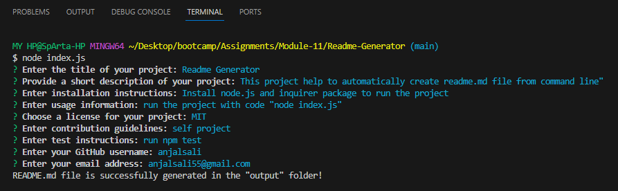

# Readme-Generator 

## Description

When creating an open source project on GitHub, it's important to have a high-quality README for the app. This command-line application helps you quickly generate a professional README.md file by dynamically taking user input. This allows you to focus more on your project rather than spending time on documentation.

Image showing command line promt of Readme-Generator application.

## Installation

To install the Professional README Generator, follow these steps:

1. Clone the repository to your local machine.
2. Navigate to the project directory.
3. Run the command `npm install` to install the required dependencies.

## Usage

To use the application, follow these steps:

1. Open a terminal.
2. Navigate to the project directory.
3. Run the command `node index.js`.
4. Answer the prompts to provide information about your project.

## License

This project is licensed under the MIT license.

## Contributing

Feel free to contribute to the success of this project. Follow these guidelines:

1. Fork the repository.
2. Create a new branch for your feature or bug fix.
3. Commit your changes.
4. Push to your branch.
5. Submit a pull request.

## Credits

The following articles and websites are used as references for this particular project.

[Professional README Guide](https://coding-boot-camp.github.io/full-stack/github/professional-readme-guide)

[Node.js](https://nodejs.org/en/learn/getting-started/introduction-to-nodejs)

[Inquirer Package](https://www.npmjs.com/package/inquirer)

## Walkthrough video Link

[Project Demo](https://drive.google.com/file/d/1QKKehL2Yxbt9PvhT3bk2vA3Jw71gYjEe/view)
